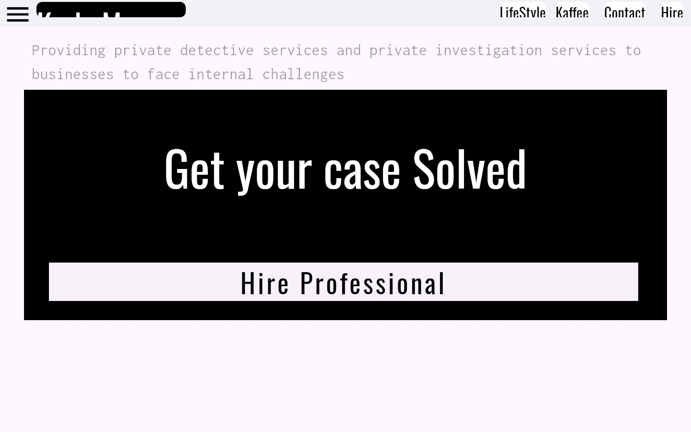
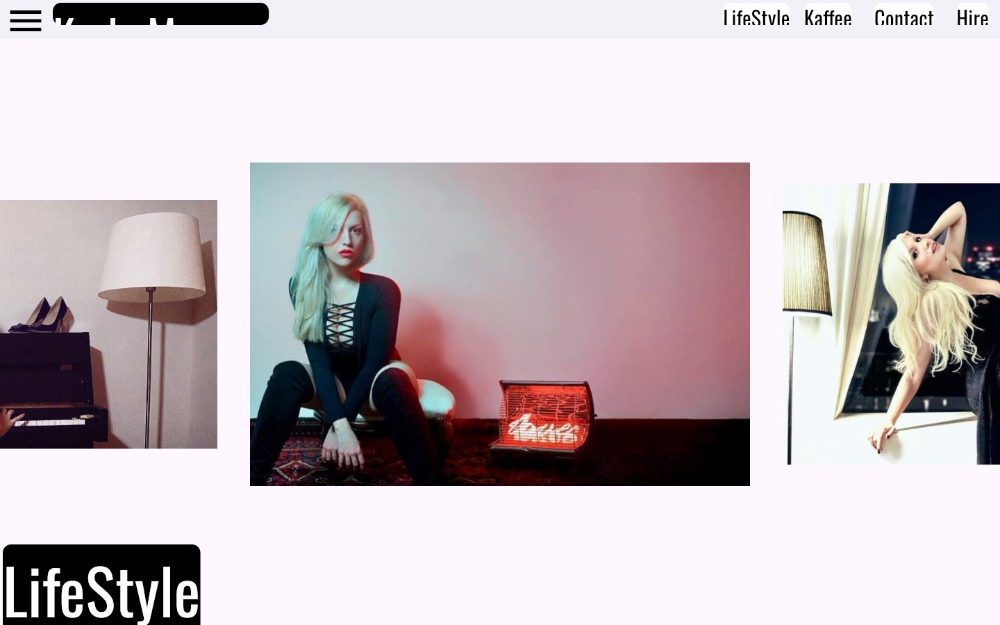
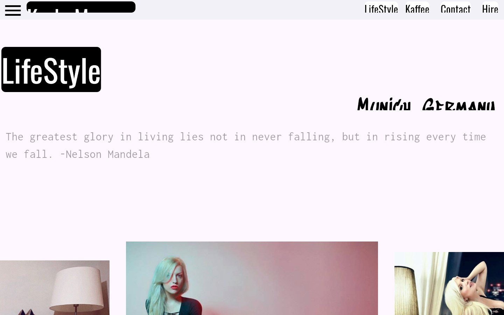
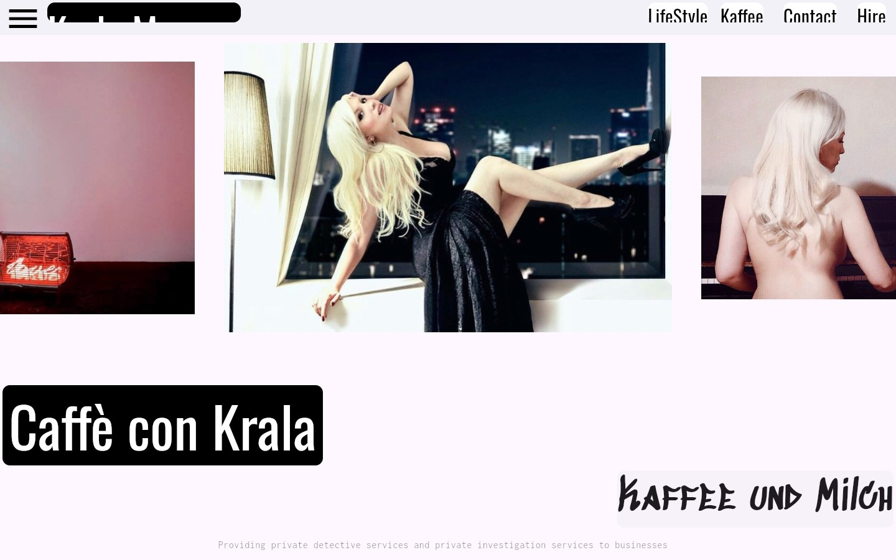
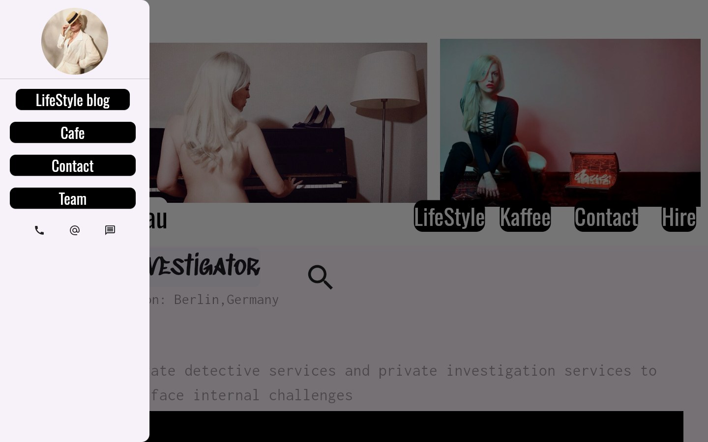
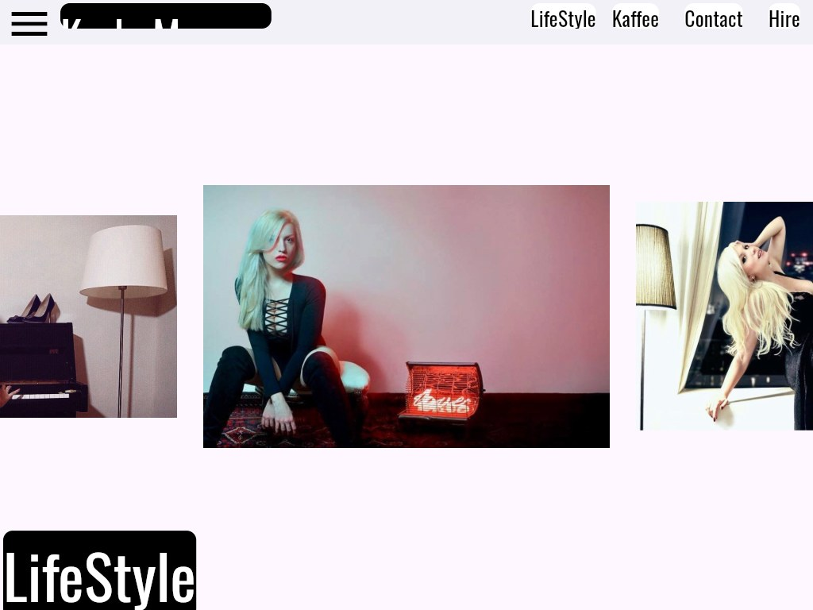
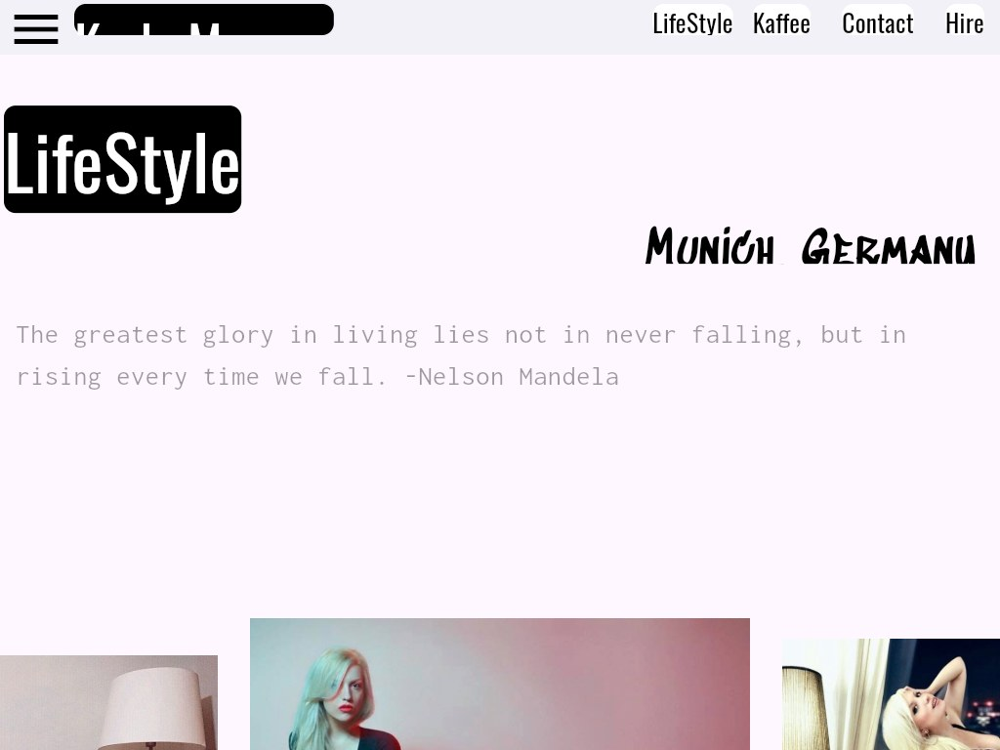
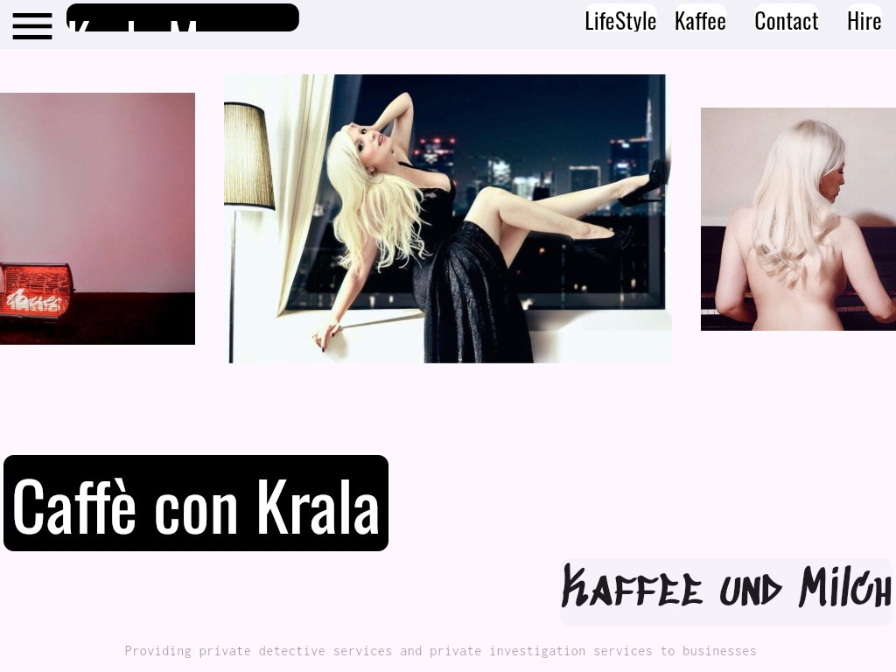
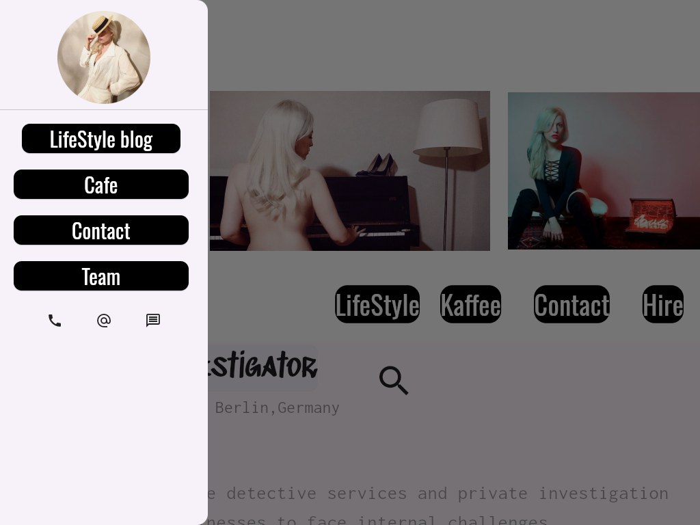
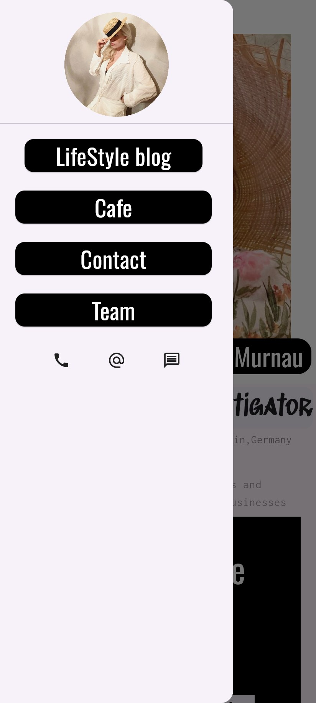

# Drenlab Krala Murnau Portfolio

A Flutter application developed for DrenLab, serving a private investigator in Italy. Key features include dynamic card transitions on scrolling, nested scrolling capabilities, and remote location adjustments by the admin

## Screenshots

All screenshots below come from a release build of this repository (`flutter build web --release`), opened in Chromium at desktop, tablet and phone widths. The debug banner is off (`debugShowCheckedModeBanner: false` in `lib/main.dart`). The phone-width shots use the same `Mobile` layout that the Android build renders, because `ResponsiveHandler` picks the layout by width.

### Web (desktop, 1440 x 900)

The `Web` layout is used whenever the window is wider than 800 px. The hero carousel auto-plays, and the header cards flip from white-on-black to black-on-white once you scroll past the first section.

| Home | Hire Professional (collapsed header) | LifeStyle carousel |
| --- | --- | --- |
|  |  |  |

| City and quote | Caffè con Krala | Navigation drawer |
| --- | --- | --- |
|  |  |  |

### Web (tablet, 1024 x 768)

| Home | LifeStyle carousel | City and quote |
| --- | --- | --- |
|  |  |  |

| Caffè con Krala | Navigation drawer |
| --- | --- |
|  |  |

### Web (mobile browser, 412 x 915)

Below 800 px the same web build switches to the `Mobile` layout, so this is what the site looks like in a phone browser.

| Home | Collapsed header | Hire Professional | LifeStyle |
| --- | --- | --- | --- |
|  |  |  |  |

| LifeStyle and city | Kaffee und Milch | Navigation drawer |
| --- | --- | --- |
|  |  |  |

## Learning Context

This repository is one of my Flutter learning projects and course examples. I use it as a reference implementation for students and as a compact practice codebase while teaching Flutter concepts through the material published at [sagnikbhattacharya.com/courses](https://sagnikbhattacharya.com/courses).

## What This Project Is For

- following along with a lesson or module from the course
- revisiting a focused Flutter concept in a smaller repository
- testing release builds and platform setup without rewriting the teaching code
- keeping a practical sample app available for future revision

## Supported Platforms

`android`, `ios`, `web`, `windows`

## Build Commands

```bash
flutter pub get
flutter build apk --release
flutter build web --release
```

## Notes For Students

- This repository is primarily for learning, experimentation, and revision.
- I generally avoid changing lib/ unless the lesson itself requires it, so compatibility updates are usually handled in tooling, dependency, or platform files.
- Some projects may intentionally stay close to the version used during teaching so the code remains easier to compare with the course walkthrough.
- Use the project together with the matching lesson for the best context instead of treating it as a finished production product.
